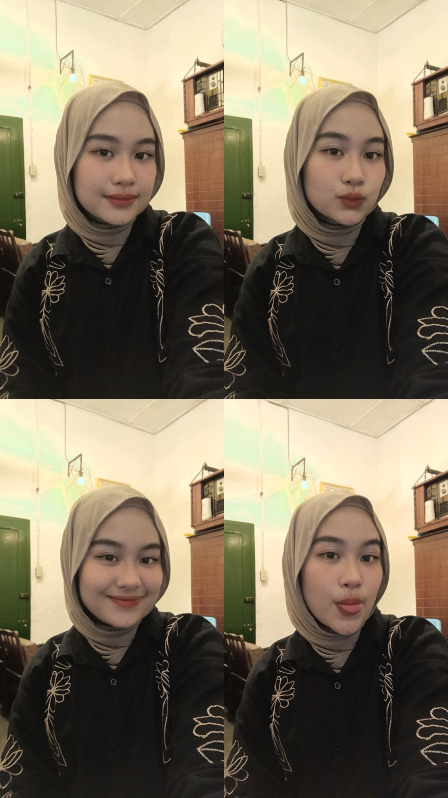
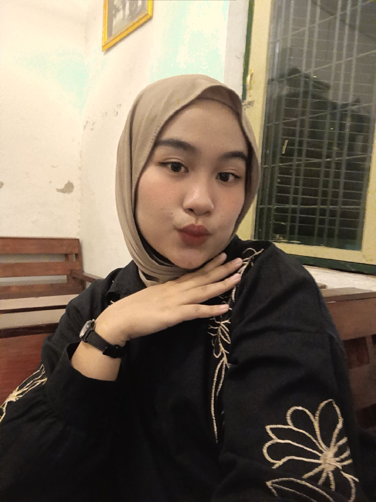
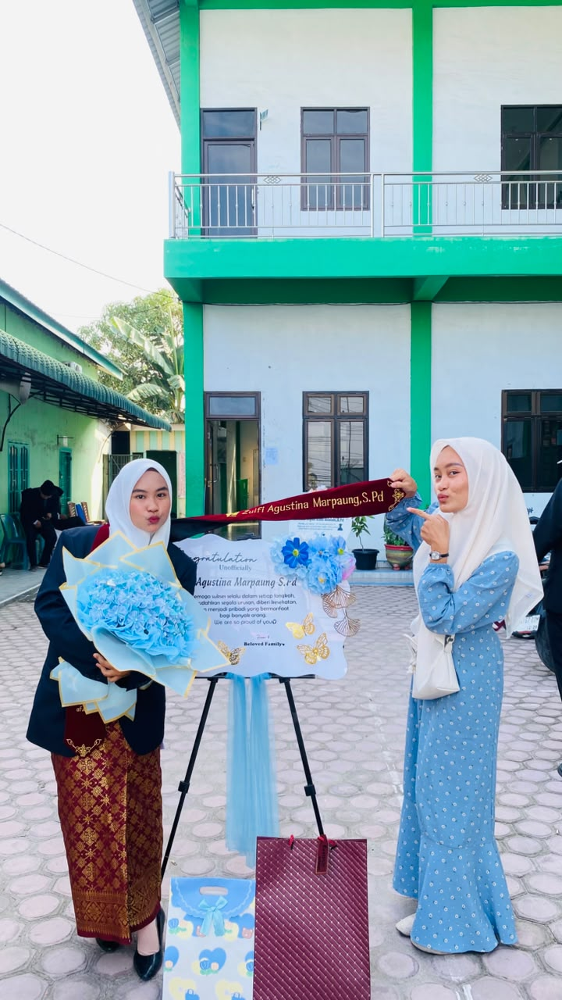
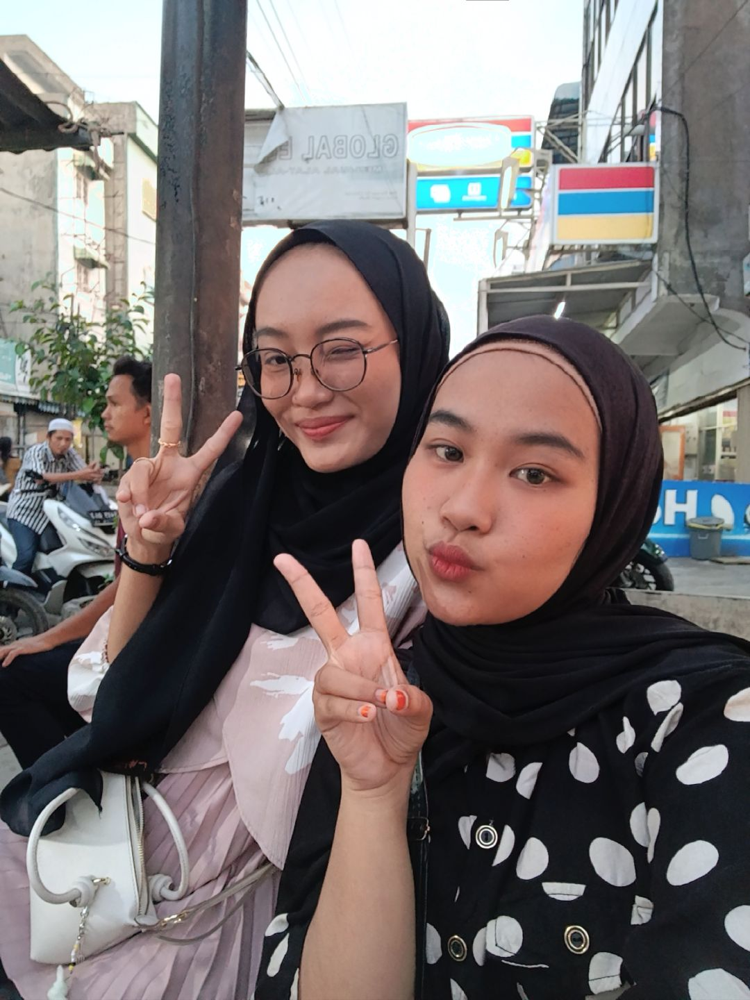

<html lang="id">
<head>
  <meta charset="UTF-8">
  <meta name="viewport" content="width=device-width, initial-scale=1.0">
  <title>Happy Birthday, Bestie!</title>
  
</head>
<body>

  <!-- Audio Player (Hidden UI, Controlled by Floating Button) -->
  <!-- Ganti 'lagu.mp3' sesuai nama file audio di repositori -->
  <audio id="bg-music" loop>
    <source src="ssstik.io_1785631568856.mp3" type="audio/mpeg">
  </audio>

  <!-- Music Control Button -->
  
🎵

  <!-- Background Light Particles -->
  <canvas id="particles-canvas"></canvas>

  <!-- Main Content -->
  

    <h1>Selamat Ulang Tahun! ✨</h1>
    
Untuk sahabatku

    <!-- 4 Photos Section -->
    

      

        
      

      

        
      

      

        
      

      

        
      

    

    <!-- Short Wish Message -->
    

      

        Selamat bertambah usia! 
        Semoga di usiamu yang baru ini, segala impianmu perlahan terwujud, selalu diberi kesehatan, 
        serta kebahagiaan yang tak pernah putus. <i>Stay awesome!</i> 🥂✨
      

    

  

  <!-- Scripts -->
  

</body>
</html>
<html lang="id">
<head>
  <meta charset="UTF-8">
  <meta name="viewport" content="width=device-width, initial-scale=1.0">
  <title>Happy Birthday, Bestie!</title>
  
</head>
<body>

  <!-- Background Light Particles -->
  <canvas id="particles-canvas"></canvas>

  <!-- Main Content -->
  

    <h1>Selamat Ulang Tahun! ✨</h1>
    
Untuk sahabatku

    <!-- 4 Photos Section -->
    

      

        <!-- Ganti 'foto1.jpg' dengan nama file fotomu -->
        
      

      

        <!-- Ganti 'foto2.jpg' dengan nama file fotomu -->
        
      

      

        <!-- Ganti 'foto3.jpg' dengan nama file fotomu -->
        
      

      

        <!-- Ganti 'foto4.jpg' dengan nama file fotomu -->
        
      

    

    <!-- Short Wish Message -->
    

      

        Selamat bertambah usia! 
        Semoga di usiamu yang baru ini, segala impianmu perlahan terwujud, selalu diberi kesehatan, 
        serta kebahagiaan yang tak pernah putus. <i>Stay awesome!</i> 🥂✨
      

    

  

  <!-- Floating Particles Script -->
  

</body>
</html>
